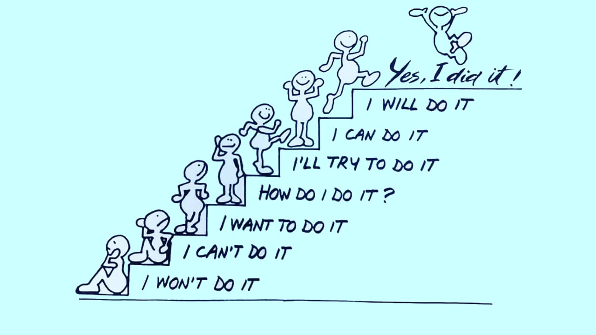
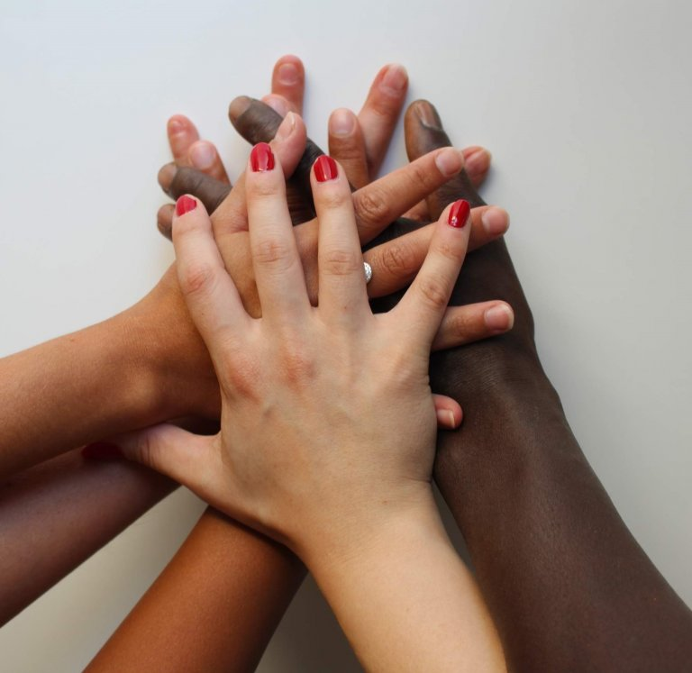

**Writer** | **Fiona**  
**Picture** | **from google**  

# She Meets Coding

## Share your story with technology #HERstory

### One hour coding challenge

#### Organized by

_United Nations Development Programme_

_UN Women_

_Girls Coding Club_ 

The detailed challenges of today is to establish a self-built webpage and showcase my #TechMeetsHer #HERstory in the form of a graphic or short video by choosing the following angles 😉

- Your own story of breaking through gender stereotypes and developing a career in a technology-related field
- Your story of how you were unable to pursue your dream due to the traditional concept of society and your inner expectation
- The story of a successful woman in technology that you are close to or know of

> ## Under the framework of the UN #EqualGeneration advocacy campaign, UNDP and UN Women launched the #HERstory #TechMeetsShe initiative, focusing on the technology sector and opening a call for stories to bring many individual stories together to give confidence to women who want to enter the technology sector.

I would like to take this challenges because I want to have a voice in this field and i am more than happy to share my story about how I have developed my career with technology.

#### *"That's not for you." - That is just the most horrifying advice ever.*

Growing up in a small town in South China, no one ever told a girl that sofeware engineering could be a career option. There were no coding class offered in middle school, nor high school. Teachers would tell the girls that languages are very important, and all you need to master is "english", then you can have a good career. For the first 22 years of my life, even after I graduated college, I had hardly learn a word about programming, not to mention any engineering technology. I dont know how anyone would do that, nor I may have a chance to be one of them. All I know about programmers are from TV or later on meeting people at work, where the coders from the IT department are always presented as genius-level checkered-shirt-wearing dudes - but certainly not for a creative minded girl like me.

I had the first idea to learn programming when I was 23, when I saw those guys who (seemed) earns so much effortlessly. I told my family and friends that I want to learn more. But they just keep telling me that is not a thing for a girl like me. Girls shall just be doing more social and simple work, instead of sitting and typing on the desk. 

#### *Simply telling women to "Believe in yourself"  is the secret to getting what they want out of life, it is not preposterous, it’s poisonous. because we will make it.*

But I dont believe that. I want to try and do it. I am glad that I met my new tutor. She gave me the freedom to do whatever I think I can, led me herself and also gave me the resource to achieve what I want.  Thanks to her support, now I am able to pitch coding as a career path and thriving in my new career, working in a company I like, and be who I would like to be.
  

#### *Coding is one of the few careers that can take you truly extraordinary places without extraordinary experience.*

That it is one of the few highly prestigious and well-paid careers that we can teach ourself entirely online and with nearly no financial resources.

We do NOT have to be a whiz in math and science to be a coder. There are different types of programming. Some involves complex problem-solving, but others could merely just be artistic and creative. 

With my simple story, I just want to encourage girls to belive in yourself, and not let others define who you are. Please, if you’re also considering a career change, if you want a new path or new opportunity, consider coding. 

Is it difficult? Yes, and no. Life as a developer takes serious willpower, discipline, and resiliency. But you are never alone. We are all here for you. 

  

At last, I would like to share this coding course with you all, who might be intersted in joining this journey with me. Feel free to look it up. 

<iframe frameborder="0" src="https://t.cn/A6tdAf31?m=4616596897138469&u=1826648747" allowFullScreen="true"></iframe>
